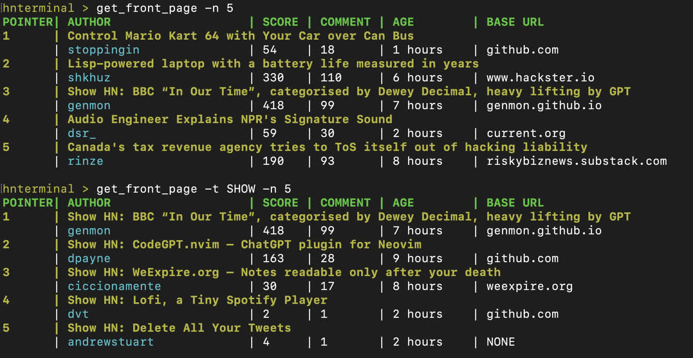
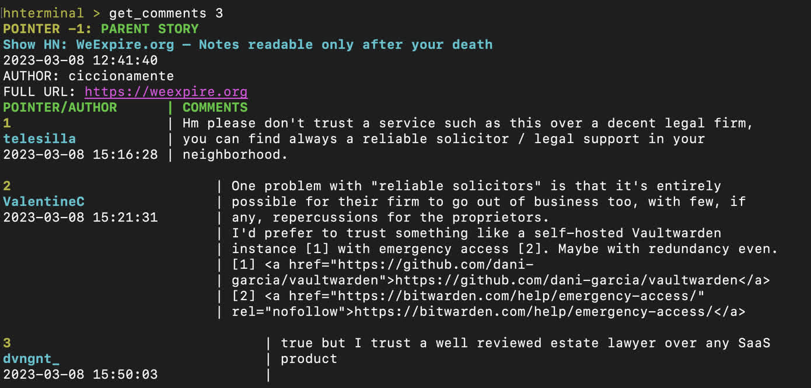
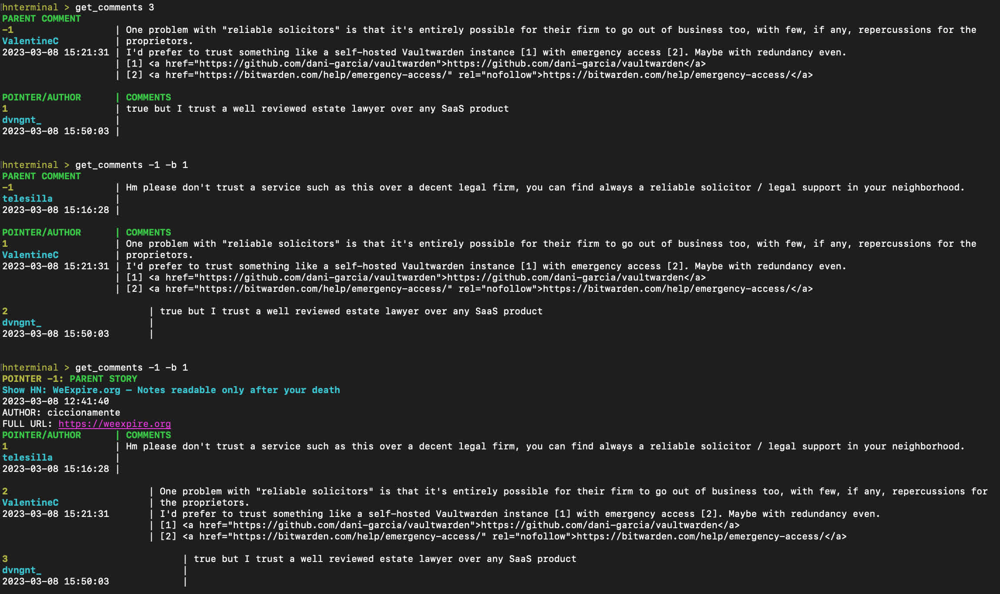
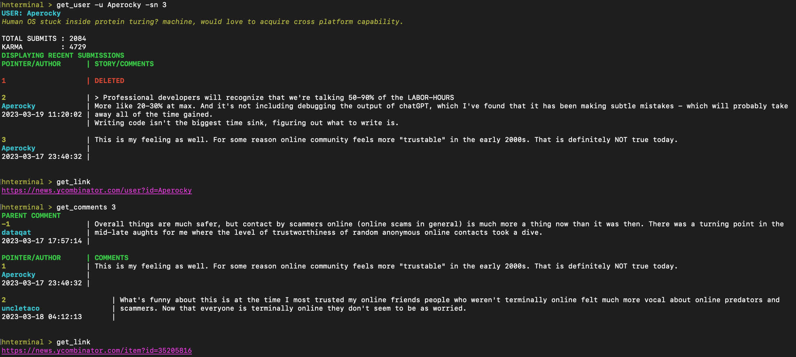
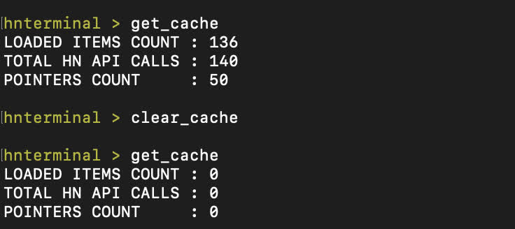
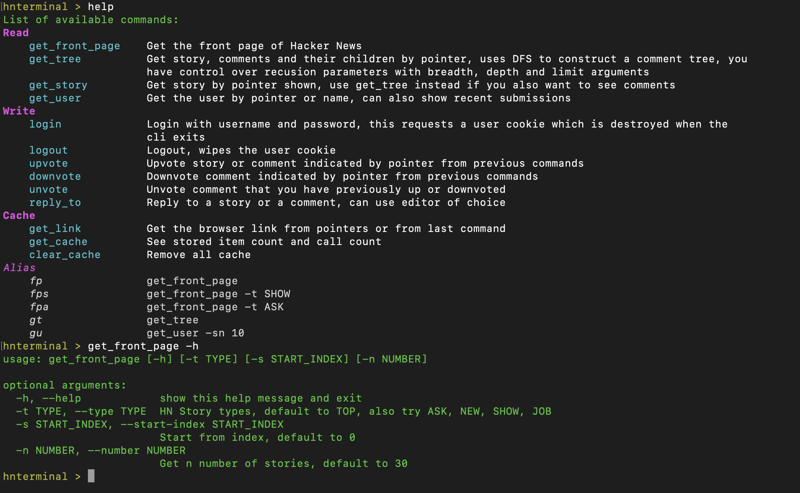

# hnterminal

`pip install hnterminal`

HN browser in terminal, supports browsing, login, upvote and comment reply.

Supports editing of comments in editor such as vim.

Built on top of [HN API](https://github.com/HackerNews/API) and [replbuilder](https://github.com/Aperocky/replbuilder)

## Installation

`pip install hnterminal`

`$ hnterminal` will invoke the terminal command from shell, if pip installation is in your `PATH`

You may also run `python src/cli.py` off current repository.

## Usage

Getting current front page information for any HN front page categories (`-n` default to 30, but here at 5):



Navigate using `POINTER` stored over previous command, `get_comments`, `get_user`, `get_story` all accept pointers:



This terminal tool is *responsive!* Adjust to terminal width if you use a larger display, or move your terminal to a different display. Each command would adjust at call time, no need to quit browsing.


`get_comments` use DFS to create a comment tree, you can control the parameter to set depth level, breadth, and limit for loading comments.

Additionally, `-1` pointer is reserved for parent of comments, so you can trace a comment all the way up:



parent trace is helpful since you can see user comments via `get_user`

`get_user get_comments get_story` also support manual input (in addition to pointers), you can also utilize `get_link` on any previous commands to get the link to browser:



All story, comments you see are stored in the cache, for instant retrieval. However, each `get_front_page` call would invoke a call to front page to get the most recent list and order.



Help and direction is readily available for every command as this package depends on [replbuilder](https://github.com/Aperocky/replbuilder):



Login, Upvote, and comment reply functionalities are in, will expand usage section after they are thoroughly tested.

## Usage (No Image)

See a textual demo (colors, bold, styles not available via markdown):

```
$ hnterminal

hnterminal > ls
List of available commands:
Read
    get_front_page    Get the front page of Hacker News
    get_story         Get story by pointer shown, use get_comments instead if you also
                      want to see comments
    get_comments      Get comments by pointer, works with both stories and comments,
                      uses DFS to construct a comment tree, control the recusion
                      parameters with breadth, depth and limit arguments
    get_user        Get the author by pointer or name, can also show recent
                      submissions
Cache
    get_cache         See stored item count and call count
    clear_cache       Remove all cache

hnterminal > get_front_page -n 5
POINTER| AUTHOR                   | SCORE | COMMENT | AGE        | BASE URL
1      | Battery-free Game Boy
       | thunderbong              | 69    | 9       | 1 hours    | www.freethegameboy.info
2      | Control Mario Kart 64 with your car over CAN bus (2016)
       | stoppingin               | 91    | 30      | 3 hours    | github.com
3      | Lisp-powered laptop with a battery life measured in years
       | shkhuz                   | 404   | 122     | 8 hours    | www.hackster.io
4      | Show HN: BBC “In Our Time”, categorised by Dewey Decimal, heavy lifting by GPT
       | genmon                   | 439   | 109     | 8 hours    | genmon.github.io
5      | Audio engineer explains NPR's signature sound (2015)
       | dsr_                     | 105   | 53      | 4 hours    | current.org

hnterminal > get_front_page -t SHOW -n 5
POINTER| AUTHOR                   | SCORE | COMMENT | AGE        | BASE URL
1      | Show HN: BBC “In Our Time”, categorised by Dewey Decimal, heavy lifting by GPT
       | genmon                   | 439   | 109     | 8 hours    | genmon.github.io
2      | Show HN: CodeGPT.nvim – ChatGPT plugin for Neovim
       | dpayne                   | 172   | 29      | 11 hours   | github.com
3      | Show HN: WeExpire.org – Notes readable only after your death
       | ciccionamente            | 36    | 20      | 10 hours   | weexpire.org
4      | Show HN: SearQ - A REST API that allows users to search from RSS feeds
       | daviducolo               | 26    | 6       | 14 hours   | searq.org
5      | Show HN: Lofi, a Tiny Spotify Player
       | dvt                      | 2     | 1       | 4 hours    | github.com

hnterminal > get_comments 3
POINTER -1: PARENT STORY
Show HN: WeExpire.org – Notes readable only after your death
2023-03-08 12:41:40
AUTHOR: ciccionamente
FULL URL: https://weexpire.org
POINTER/AUTHOR      | COMMENTS
1                   | interesting SaaS. now, you have any plan in case you go out of business?
mariorojas          |
2023-03-08 23:22:37 |

2                   | Hm please don't trust a service such as this over a decent legal firm,
telesilla           | you can find always a reliable solicitor / legal support in your
2023-03-08 15:16:28 | neighborhood.

3                         | One problem with "reliable solicitors" is that it's entirely
ValentineC                | possible for their firm to go out of business too, with few, if
2023-03-08 15:21:31       | any, repercussions for the proprietors.
                          | I'd prefer to trust something like a self-hosted Vaultwarden
                          | instance [1] with emergency access [2]. Maybe with redundancy even.
                          | [1] <a href="https://github.com/dani-
                          | garcia/vaultwarden">https://github.com/dani-garcia/vaultwarden</a>
                          | [2] <a href="https://bitwarden.com/help/emergency-access/"
                          | rel="nofollow">https://bitwarden.com/help/emergency-access/</a>

4                               | true but I trust a well reviewed estate lawyer over any SaaS
dvngnt_                         | product
2023-03-08 15:50:03             |
... more output omitted ...


hnterminal > get_user -u Aperocky -sn 3
USER: Aperocky
Human OS stuck inside protein turing? machine, would love to acquire cross platform capability.

TOTAL SUBMITS : 2084
KARMA         : 4729
DISPLAYING RECENT SUBMISSIONS
POINTER/AUTHOR      | STORY/COMMENTS

1                   | DELETED

2                   | > Professional developers will recognize that we're talking 50-90% of
Aperocky            | the LABOR-HOURS
2023-03-19 11:20:02 | More like 20-30% at max. And it's not including debugging the output of
                    | chatGPT, which I've found that it has been making subtle mistakes -
                    | which will probably take away all of the time gained.
                    | Writing code isn't the biggest time sink, figuring out what to write is.

3                   | This is my feeling as well. For some reason online community feels more
Aperocky            | "trustable" in the early 2000s. That is definitely NOT true today.
2023-03-17 23:40:32 |


hnterminal > get_link
https://news.ycombinator.com/user?id=Aperocky

hnterminal > get_comments 3
PARENT COMMENT
-1                  | Overall things are much safer, but contact by scammers online (online
dataqat             | scams in general) is much more a thing now than it was then. There was a
2023-03-17 17:57:14 | turning point in the mid-late aughts for me where the level of
                    | trustworthiness of random anonymous online contacts took a dive.

POINTER/AUTHOR      | COMMENTS
1                   | This is my feeling as well. For some reason online community feels more
Aperocky            | "trustable" in the early 2000s. That is definitely NOT true today.
2023-03-17 23:40:32 |

2                         | What's funny about this is at the time I most trusted my online
uncletaco                 | friends people who weren't terminally online felt much more vocal
2023-03-18 04:12:13       | about online predators and scammers. Now that everyone is
                          | terminally online they don't seem to be as worried.


hnterminal > get_link
https://news.ycombinator.com/item?id=35205816

hnterminal > get_user 2
USER: uncletaco
TOTAL SUBMITS : 388
KARMA         : 948
```
