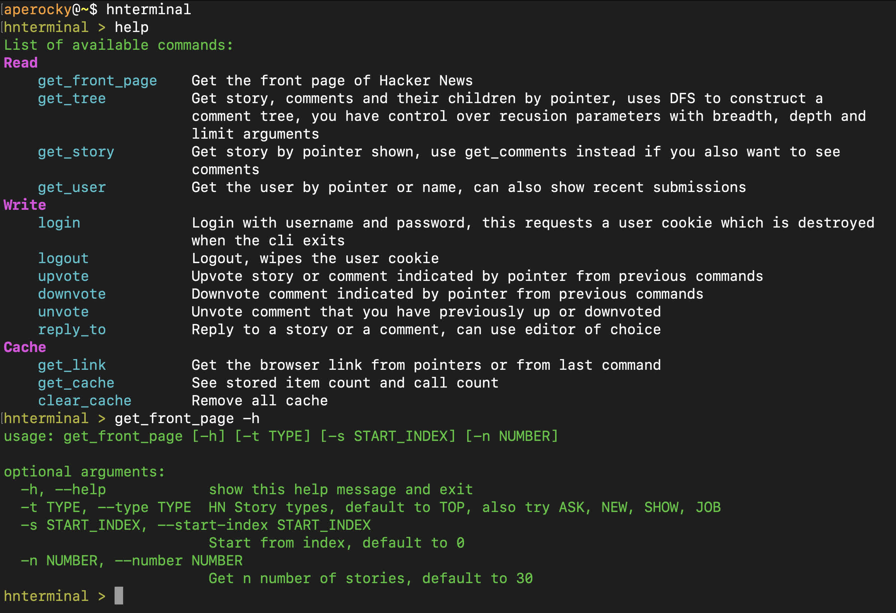
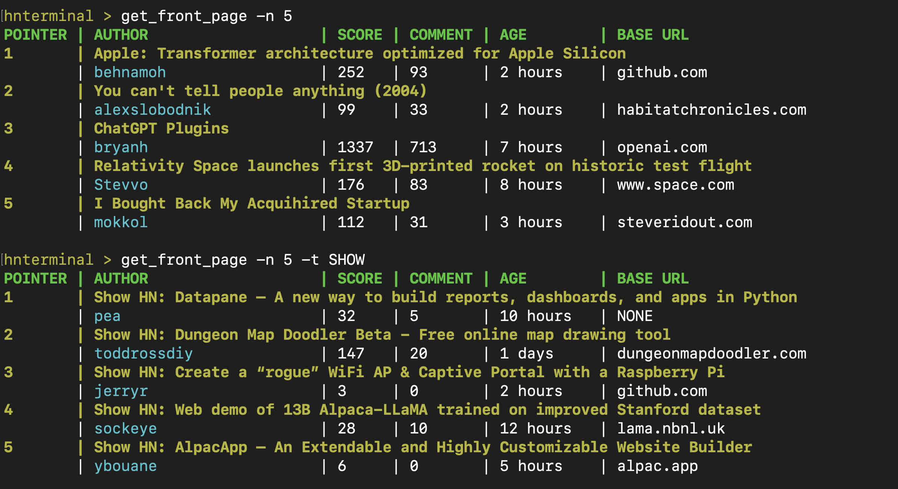
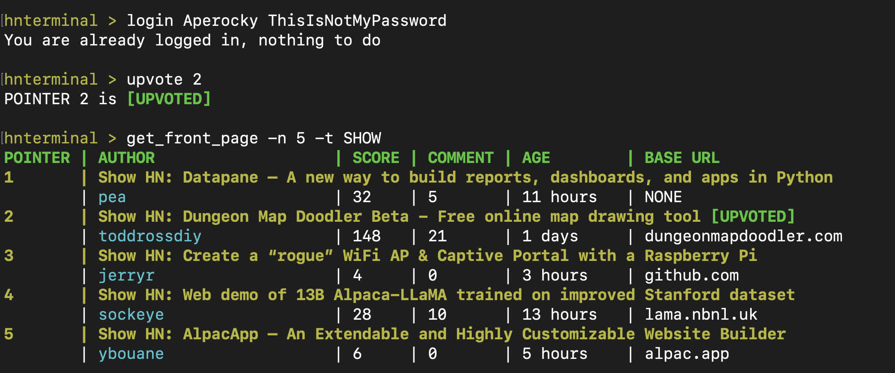
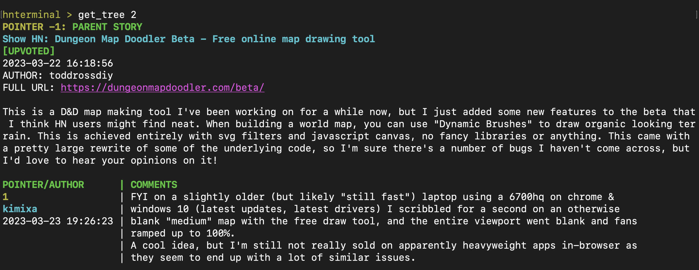
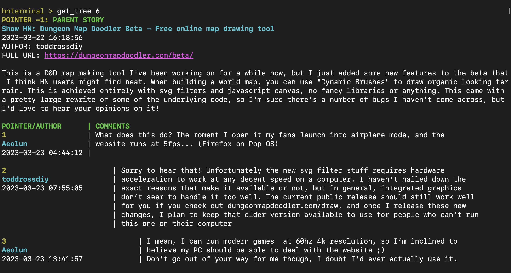
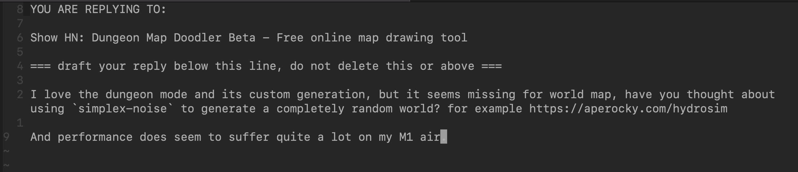
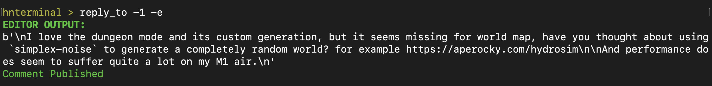
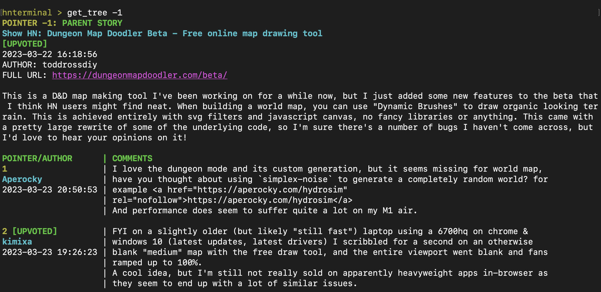
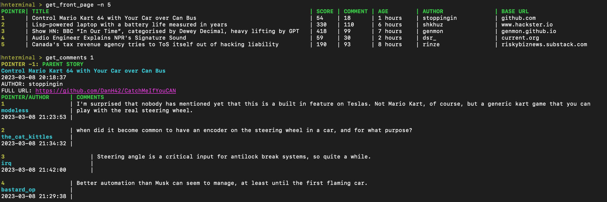

# hnterminal

`pip install hnterminal`

This CLI tool supports browsing, login, upvote and comment reply for full HN experience in the terminal.

Built on top of [HN API](https://github.com/HackerNews/API) and [replbuilder](https://github.com/Aperocky/replbuilder).

## Installation

`pip install hnterminal`

`$ hnterminal` will invoke the terminal command from shell, if pip installation is in your `PATH`

You may also run `python src/cli.py` off current repository.

## Usage

The CLI and each of its command have detailed help sections that you can utilize:



You can quickly navigate the front page:



Login and upvote what you like using pointers:



`get_tree` use DFS to create a comment tree, you can use this command on any pointer shown. Additionally, `-1` pointer is reserved for parent, so you can trace a comment all the way up.



Same command used on comments:



You can reply to story or comments utilizing the same pointer, even using an editor to craft your response:





The comment will then show up (the read API will take ~30 seconds to be up to date):



This terminal tool is *responsive!* and the output will be adjusted to the width of the terminal for everything it displays



There are more to this tool, for instance, it has the capability to show user info and history, it enables seamless browsing experience by maintaining a cache which status you can check with cache commands, which you may want to clear from time to time to keep it from going stale if you spend hours in this tool. The ultimate goal is to provide the same HN browsing experience in the terminal.

## Usage (No Image)

See a textual demo (color and styles not available via markdown):

```
aperocky@~$ hnterminal
hnterminal > get_front_page -n 5
POINTER | AUTHOR                   | SCORE | COMMENT | AGE        | BASE URL
1       | Apple: Transformer architecture optimized for Apple Silicon
        | behnamoh                 | 330   | 134     | 3 hours    | github.com
2       | You can't tell people anything (2004)
        | alexslobodnik            | 131   | 53      | 3 hours    | habitatchronicles.com
3       | ChatGPT Plugins
        | bryanh                   | 1393  | 754     | 8 hours    | openai.com
4       | Relativity Space launches first 3D-printed rocket on historic test flight
        | Stevvo                   | 186   | 90      | 9 hours    | www.space.com
5       | I Bought Back My Acquihired Startup
        | mokkol                   | 137   | 41      | 4 hours    | steveridout.com

hnterminal > login USERNAME PASSWORD
Successfully logged in as USERNAME

hnterminal > upvote 4
POINTER 4 is [UPVOTED]

hnterminal > get_tree 4
POINTER -1: PARENT STORY
Relativity Space launches first 3D-printed rocket on historic test flight
2023-03-23 12:28:25
AUTHOR: Stevvo
FULL URL: https://www.space.com/relativity-space-terran-1-test-launch-failure
POINTER/AUTHOR      | COMMENTS
1                   | honestly the most impressive part of relativity space is how young their founder is.
croatiancoder       | 
2023-03-23 12:35:58 | 

2 [UPVOTED]               | Jordan was 22 when they started!!
jessfraz                  | 
2023-03-23 15:14:19       | 

3                               | Damn he’s my age and I’m still a startup engineer while he’s leading rocket
robopsychology                  | engineering lol - what a person!
2023-03-23 18:56:21             | 

4                               | How does a 22 year old get the funding to start something like this?
AnimalMuppet                    | 
2023-03-23 15:53:02             | 

hnterminal > reply_to 1 -e
... opens vim editor ...

EDITOR OUTPUT:
"... whatever you wrote ..."
Comment Published
```
